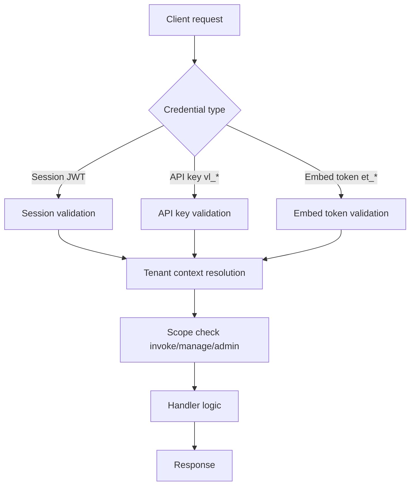

# Auth and Request Flow

This page shows how requests are authenticated and authorized before Velane executes work.

## High-level flow

## What this means for users

- Authentication answers: who is calling?
- Scope checks answer: what can they do?
- Tenant context answers: where can they do it?

All three are needed for safe multi-tenant behavior.

## Practical examples

- Dashboard user: session login, tenant selected in UI, role-based access
- CI automation: API key with least required scope
- Embedded usage: embed token with reduced privileges

## Related docs

- [Credentials and Scopes](./credentials-and-scopes.md)
- [Security Non-Negotiables](../security/non-negotiables.md)
- [Request Lifecycle](../invoke/request-lifecycle.md)
