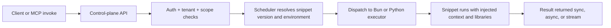

# Request Lifecycle

This page explains what happens after you invoke a snippet.

## End-to-end lifecycle

## Why this architecture matters

- policy and tenancy are centralized in control-plane
- execution stays isolated in runtime services
- one invoke API supports multiple execution modes

## Mode-specific behavior

- sync: waits for result
- async: queues work and returns early
- stream: returns incremental events

## Related docs

- [Invocation Modes](./invocation-modes.md)
- [Auth and Request Flow](../auth-tenancy/auth-and-request-flow.md)
- [Deployment Topology](../operations/deployment-topology.md)
